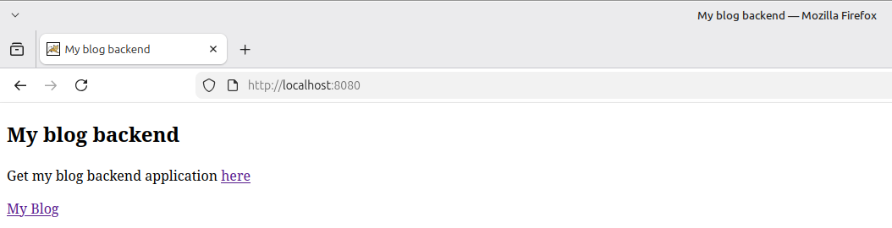
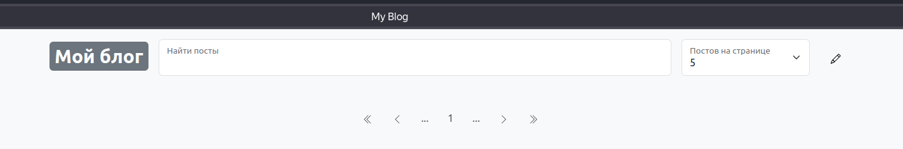

# Модуль 1. Спринт 4. Бэкенд приложения-блога с использованием Spring Boot и Spring Boot Test

## Описание

Бэкенд работает во встроенном сервлет-контейнере Tomcat, принимает REST-запросы от фронтенда на http://localhost:8080/,
отправляет SQL-запросы на создание/получение/изменение/удаление данных в Embedded In-Memory базу данных H2, формирует
ответ и возвращает фронтенду.

## Сборка, тестирование и публикация

- Приложение упаковывается в Executable Jar и запускается во встроенном сервлет-контейнере Tomcat.
- Как собирать:```./gradlew clean bootJar```
    - executable Jar расположен: ```my-blog-back-app/build/libs/my-blog-back-app-0.0.1-SNAPSHOT.jar```
- Как запускать тесты:```./gradlew test```
    - результаты тестов расположены: ```my-blog-back-app/build/reports/tests/test/index.html```

## Как запускать

- Собрать бэкенд
- Запустить тесты
- Запустить и опубликовать бэкэнд во встроенном сервлет-контейнере Tomcat:
    - выполнить команду ```java -jar ./build/libs/my-blog-back-app-0.0.1-SNAPSHOT.jar```
- Перейти по адресу: http://localhost:8080/ на страницу продукта
  

## Как использовать

- Запустить бэкенд
- Запустить фронтенд:
    - Скачать архив с фронтендом приложения-блога: https://code.s3.yandex.net/middle-java/my-blog-front-app.zip
    - Распаковать zip-архив
    - Перейти в директорию с docker-compose.yaml
    - Запустить в терминале```docker compose up -d```
    - Запустить в терминале```docker ps``` и убедиться, что контейнер с фронтендом запущен (остановить фронтенд можно
      командой```docker compose down``` в терминале
- Открыть браузер и зайти на http://localhost
  